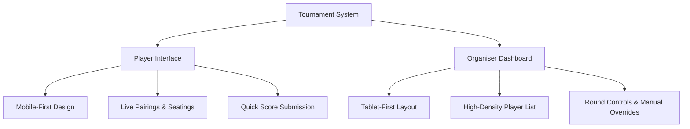

# Market Research: Web-Based Tournament Pairings Systems

This report analyzes the current landscape of web-based tournament pairing systems, particularly for Trading Card Games (TCGs) utilizing the Swiss pairings format. It reviews existing products, their core algorithmic differences, user requirements, and legal compliance constraints.

---

## 1. Competitive Landscape

Several platforms dominate the TCG tournament management software space, ranging from community-driven tools to official, enterprise-scale platforms.

### Industry-Leading Platforms

#### 1. [Melee.gg](https://melee.gg/)
* **Target Audience:** Large-scale competitive organizers and premier events (e.g., Magic: The Gathering, Disney Lorcana, Star Wars: Unlimited).
* **Key Features:** Widely considered the current industry standard. Excels at complex Swiss pairings, "Top Cut" elimination brackets, customizable tiebreaker hierarchies, deck list verification, and real-time live standings.
* **Strengths:** Robustness, API integrations, and built-in player messaging.
* **Limitations:** Higher complexity for casual local game stores (LGS).

#### 2. [TopDeck.gg](https://topdeck.gg/)
* **Target Audience:** Local game stores and medium-sized tournament organizers.
* **Key Features:** Features a streamlined, user-friendly interface focused on speed. Automates Swiss pairings, standings, and results submission.
* **Strengths:** Speed of setup, minimal learning curve, and high reliability.
* **Limitations:** Fewer features for complex, multi-day premier events.

#### 3. [RK9 Labs](https://rk9.gg/)
* **Target Audience:** Official Pokemon TCG premier events (Regionals, Internationals, World Championships).
* **Key Features:** Direct integration with official player databases, mandatory deck list submission with verification, and strict adherence to official rules.
* **Strengths:** Highly secure, specialized validation pipelines, and direct endorsement by publishers.
* **Limitations:** Access is heavily restricted and typically reserved for sanctioned organizers.

#### 4. [Limitless TCG](https://limitlesstcg.com/)
* **Target Audience:** Online grassroots tournaments and community organizers.
* **Key Features:** Offers an integrated, free-to-use tournament platform for running and reporting Swiss brackets, as well as compiling tournament statistics.
* **Strengths:** Free, deep analytical integration, and high popularity in the Pokémon TCG community.

#### 5. [ManaSync](https://manasync.com/)
* **Target Audience:** Free/casual organizers who want no-cost bracket administration.
* **Key Features:** Automated Swiss brackets, live score tracking, and player registries.
* **Strengths:** 100% free with no premium paywalls.

---

## 2. Technical & Algorithmic Comparison

Swiss tournament pairings require balancing multiple competing constraints. The two primary algorithmic paradigms used are:

### Greedy Matching vs. Maximum Weight Matching

| Metric / Aspect | Greedy Pairing (Heuristic) | Maximum Weight Matching (Edmonds-Blossom) |
| :--- | :--- | :--- |
| **Logic** | Pairs players sequentially (top-down or bottom-up) based on their current match points. | Models the entire player field as a graph; finds a global maximum weight perfect matching (MWPM). |
| **Optimization** | Local optimization. If a pairing is valid at the moment, it is committed. | Global optimization. Balances all matchups in the field to minimize total score deviation. |
| **Jams / Deadlocks** | Prone to "jams" in later rounds where remaining players cannot be paired (requires complex backtracking). | Solves or avoids jams mathematically by looking at the graph as a whole. |
| **Edge Case Handling** | Harder to scale cleanly when adding multi-tier constraints (e.g., color/side balance, repeat opponents). | Handled cleanly by assigning negative weights to bad pairings and positive weights to ideal pairings. |
| **Time Complexity** | $O(N \log N)$ (very fast, but backtracking can cause worst-case performance spikes). | $O(V^2 E)$ or $O(N^3)$ (computationally heavier but highly optimized via algorithms like Blossom V). |

### TCG Swiss Tiebreakers

When players finish with identical match records, TCGs use a strict hierarchy of tiebreakers:

1. **Opponent's Match-Win Percentage (OMW):** The average match-win percentage of all opponents a player has faced. This rewards players who played against tougher opponents.
2. **Opponent's Opponent's Match-Win Percentage (OOMW):** The average of the OMW percentages of the player's opponents. Used as a secondary tiebreaker.
3. **Opponent's Game-Win Percentage (OGW):** (For best-of-three matches) The average percentage of games won by the player's opponents.
4. **Player's Game-Win Percentage (PGW):** The player's own percentage of individual game wins.

---

## 3. User Experience (UX) Requirements

A successful Swiss pairing system must accommodate two distinct roles with contrasting device footprints.

### Player Interface (Mobile-First)
* **Context:** Players are walking around a venue, standing at tables, or holding a hand of cards.
* **Key Tasks:**
  * Find their table number and opponent for the current round instantly.
  * Check current standing and tiebreakers.
  * Submit match results (e.g., "2-0-1" or "1-2") quickly and receive confirmation.
* **UX Strategy:** Single-column layout, large tap targets, clear typography, and minimal load times.

### Organiser Dashboard (Tablet-First)
* **Context:** Organisers are stationed at a main desk, often holding a tablet to walk around and resolve disputes or key in manual changes.
* **Key Tasks:**
  * Add, drop, or edit players during registration or mid-tournament.
  * Trigger new rounds and verify pairing validity.
  * Handle manual overrides (e.g., fixing a misreported score, manually pairing players, issuing penalties).
* **UX Strategy:** Multi-column grid layouts, high data density, quick-search filter inputs, and confirmation prompts for destructive actions.

---

## 4. Legal & Compliance Landscape

Developing custom tournament software requires navigating strict publisher rules:

* **No Trademark Infringement:** Platforms must remain generic and avoid utilizing trademarked terms (e.g., specific game names like *Magic: The Gathering*) or game assets (e.g., official card art, mana symbols) unless licensed.
* **Sanctioned vs. Unsanctioned Play:** Official tournaments sanctioned by game publishers must use official proprietary software (e.g., Wizards EventLink, RK9 Labs). Independent tournament engines are limited to **unsanctioned (casual/home/store-level)** events.
